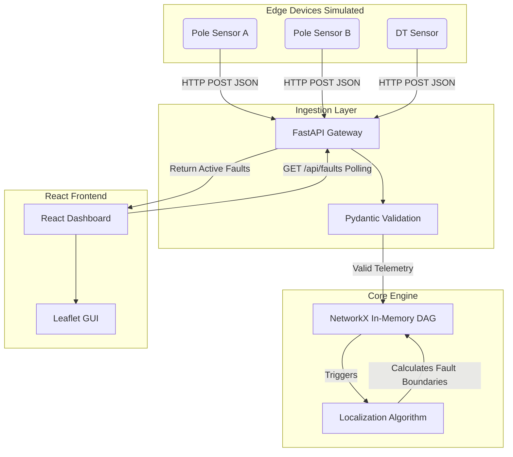

# System Architecture

## 1. Architecture Diagram (Data Flow)

## 2. Data Sourcing and Ingestion
- **Telemetry Arrival:** Devices push JSON payloads to `POST /telemetry`.
- **Validation:** Pydantic strictly validates schema types, rejecting garbage data.
- **Handling Out-Of-Order & Clock Skew:** We explicitly ignore the `ts` (timestamp) field for logical ordering because device clocks drift wildly (+/- 90s). Instead, we track the `seq` (sequence counter) on each node in memory. If an incoming message has `seq <= current_seq`, it is rejected as stale or duplicate.
- **Bursts:** FastAPI's async asynchronous request handling effectively queues and processes sudden bursts of HTTP traffic.

## 3. Storage and Internal Model
- **Storage:** We use an **In-Memory Directed Acyclic Graph (DAG)** using the `networkx` library. There is no external database (Postgres/Redis) because the physical grid topology (nodes and wire edges) is a graph mathematical problem, and executing rapid topological traversals on a memory-native graph is exponentially faster than executing recursive SQL queries on a database. 
- **Topology Representation:** Transformers (DTs) are root nodes. Poles are child nodes. Edges are the electrical wires.

## 4. The Localization Algorithm
Our engine localizes faults using a sequence of logical graph traversals rather than simple pattern matching.
- **Step 1: The Implied State Resolvers**
  - **Bottom-Up (Lying Sensor Override):** We traverse from leaves to roots. If *any* child of a node is actively reporting as LIVE, power must be flowing through the parent. We forcefully mark the parent LIVE, even if the parent's sensor is falsely reporting a power loss.
  - **Top-Down (Physical Blackout Propagation):** We traverse from roots to leaves. If a parent is DARK, all downstream children are forcefully marked DARK, because power physically cannot reach them.
- **Step 2: Boundary Detection**
  - We iterate through all edges (`u -> v`). If parent `u` is LIVE, and child `v` is DARK, we have found the exact broken span.
- **Handling 60% Missing Topology:**
  - For DTs missing their child pole ordering, we use **Spatial Imputation (Minimum Spanning Tree)**. Using the `haversine_distance` between GPS coordinates, we draw synthetic edges connecting closest neighbors outward from the DT. 
- **Grouping Symptoms / Simultaneous Faults:**
  - If a Feeder or DT fails entirely, it causes hundreds of child poles to go dark. To prevent ticket storms, if a parent DT/Feeder is marked as failed, we aggressively **suppress** boundary detection on all its children. This aggregates the outage into a single root-cause `dt_fault` or `feeder_fault` ticket.
  - Because we check every node and edge independently against the implied state, simultaneous unrelated span faults naturally spawn distinct tickets.
- **Complexity:** $O(N + E)$ for the topological sorts and edge iterations. Highly performant.
- **Known Failure Cases:** When a span fault occurs inside an *imputed* (guessed) subtree, the algorithm occasionally generates 2 tickets. This is because the guessed wiring map is mathematically imperfect, so a single physical break forces the algorithm to "break" two virtual wires to explain the sensor data.

## 5. Noise Handling
- **Dead Sensors (Silent Failures):** The system has a heartbeat sweeper. Devices emit heartbeats every 15 mins. If 0 dying gasps arrive during a blackout (due to 100% packet loss or firmware bugs), the system remains temporarily blind. However, when the 15-minute heartbeat cycle expires, the background sweeper realizes the node missed its check-in, forcefully marks it DARK, and instantly generates the ticket.
- **Scheduled Outages:** Before returning faults, the engine cross-references the active `MOCK_SCHEDULED_OUTAGES` list. If a fault targets an ID on that list, it is tagged as `is_scheduled = True` and safely ignored as an emergency.
- **False-Positive Story:** We heavily bias against false positives. The "Implied State" bottom-up resolver ensures that a broken sensor on a live wire will never trigger a crew dispatch as long as its downstream neighbors continue to report.

## 6. API Surface

| Endpoint | Method | Purpose | Shape |
|----------|--------|---------|-------|
| `/telemetry` | POST | Ingest dying gasps from devices | `[TelemetryEvent]` |
| `/api/faults` | GET | Fetch active, localized tickets | Returns `[FaultResponse]` |
| `/api/grid/topology` | GET | Fetch entire grid state for map GUI | Returns `{nodes: [], edges: []}` |
| `/api/grid/reset` | POST | Force clear all active incidents | Returns `{status}` |
| `/api/simulate/fault` | POST | Synthesize a span fault & inject it | Returns `{faults: []}` |
| `/api/simulate/fast_forward`| POST | Advance clock to trigger heartbeat sweep | Returns `{faults: []}` |
| `/api/briefing` | POST | Generate AI Crew Briefing | Accepts fault dict, Returns `{markdown}` |

## 7. UI Reasoning
- **Map-Centric First:** The operator immediately sees a dark, distraction-free spatial map. Power grid failures are geographically bound problems; operators need to see *where* the issue is immediately to dispatch local crews.
- **What I didn't put on screen:** I hid individual raw telemetry logs. Dispatchers don't care about sequence numbers or RSSI strings; they only care about actionable translated intelligence ("Span Fault on MG Road").
- **Expected Bad Decision:** Relying purely on visual markers for a city-scale grid (e.g. 50,000 poles) will lead to severe UI clutter. A real system would need clustering and list-view fallbacks for massive outages.

## 8. The AI Feature
- **What it is:** An "AI Crew Briefing" generator that ingests the raw fault data (pin codes, downstream impact, fault type) and writes a concise, formatted deployment directive for the lineman crew.
- **Why this spot:** Dispatchers spend critical minutes writing up manual briefs. Automating this saves time at the moment of highest pressure (dispatch).
- **Cost / Availability:** It uses the `g4f` integration (costing $0 via free providers, or negligible tokens if using OpenAI API). If the LLM is unavailable or hallucinates, it fails safely: the raw fault data is still available directly on the Incident Feed ticket, so no operational capability is lost.
